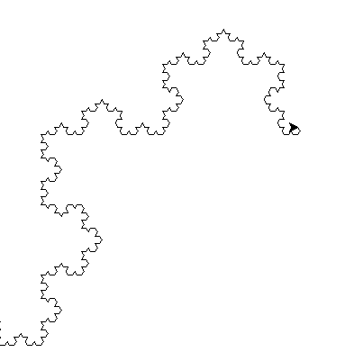

# NAVY 
### [FIELD OF STUDY at university]

    
    
    

    
    
    

## Getting Started

Link on subject: [LINK](http://navy.cs.vsb.cz/)

Link on Professor weppage: [Ivan Zelinka](https://ivanzelinka.eu/)

In this project I've elaborated tasks from lessons. There are a lot of useful algorithms related to machine learning.

### Prerequisites

1.Python interpreter

## Built With

* [Python](https://www.python.org/)

## Authors

* **Adrián Mindek** -  [Surzo18](https://github.com/surzo18)

## License

Free for non-commercial use only.

